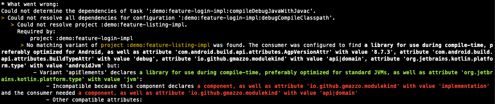

[](https://central.sonatype.com/artifact/io.github.gmazzo.modulekind/io.github.gmazzo.modulekind.gradle.plugin)
[](https://plugins.gradle.org/plugin/io.github.gmazzo.modulekind)
[](https://github.com/gmazzo/gradle-module-kind-plugin/actions/workflows/ci-cd.yaml)
[](https://codecov.io/gh/gmazzo/gradle-module-kind-plugin)
[](https://sourcegraph.com/search?q=content:io.github.gmazzo.modulekind+-repo:github.com/gmazzo/gradle-module-kind-plugin)

# gradle-module-kind-plugin

A Gradle plugin to constrain a multi-module build dependency graph.

Meant to enforce an `API/Implementation` modularisation pattern in a multi-module monolith project:

> [!NOTE]
> Credits of the picture to this good reference
>
article [Slaying the monolith: API/Implementation modularisation pattern in Android development](https://medium.com/asos-techblog/slaying-the-monolith-api-implementation-modularisation-pattern-in-android-development-22a07c24e9dd)
> by [Sean Coyle](https://medium.com/@seancoyle4)

Example of the failure when, for instance, `implementation` tries to depend on another `implementation` module:


# Usage

Apply the plugin at the root project:

```kotlin
plugins {
  java
  id("io.github.gmazzo.modulekind") version "<latest>"
}
```

Then each subproject must be configured with as `api` or `implementation`:

```kotlin
moduleKind = "api" // or "implementation" or "monolith"
```

## How it works

The plugin introduces a new `io.github.gmazzo.modulekind` attribute that:

1) Is requested on key resolvable `Configuration`s for known plugins (`java` and `android`)
2) Decorates module's [
   `Outgoing Variant`s](https://docs.gradle.org/current/userguide/variant_model.html#sec:variant-visual).
3) Is used by an [
   `AttributeCompatibilityRule`](https://docs.gradle.org/current/userguide/variant_attributes.html#sec:abm-compatibility-rules)
   to determine if is a legal dependency for its consumer

It's recommended to read
the [Understanding Variant Selection](https://docs.gradle.org/current/userguide/variant_model.html#sec:variant-aware-matching)
chapter in Gradle's manual for a better understanding.

# Configuration

By default, the plugin will provide the following compatibility table (which can be printed by running
`moduleKindConstraints` task):

| `moduleKind`   | api | implementation | monolith |
|----------------|-----|----------------|----------|
| api            | ❌   | ❌              | ❌        |
| implementation | ✅   | ❌              | ❌        |
| monolith       | ✅   | ✅              | ✅        |

These restrictions are fully configurable through the `moduleKindConstraints` DSL.
The following is the equivalent configuration of the table above:

```kotlin
moduleKindConstraints {
  "implementation" compatibleWith "api"
  "monolith" compatibleWith "implementation"
  "monolith" compatibleWith "api" // redundant, since compatibilities are transitive
}
```

Or in `groovy`:

```groovy
moduleKindConstraints {
  compatibility("implementation", "api")
  compatibility("monolith", "implementation")
  compatibility("monolith", "api") // redundant, since compatibilities are transitive
}
```

> [!NOTE]
> Compatibles are transitive. So, if `monolith` can depend on `implementation` and `implementation` on `api`,
> then `monolith` can also depend on `api`.

## Defining your own dependency constrains: domain objects use case

Like the [`demo`](demo) project, imagine you want to have an extra deep in the 4th levels dependency graph where:

- `app` is the monolith
- `implementation` and `api` are the usual setup
- `api` can also on `domain` modules, meant to share domain objects between `api`s

```kotlin
moduleKindConstraints {
  "api" compatibleWith "domain"
  "implementation" compatibleWith "api"
  "app" compatibleWith "implementation"
}
```
